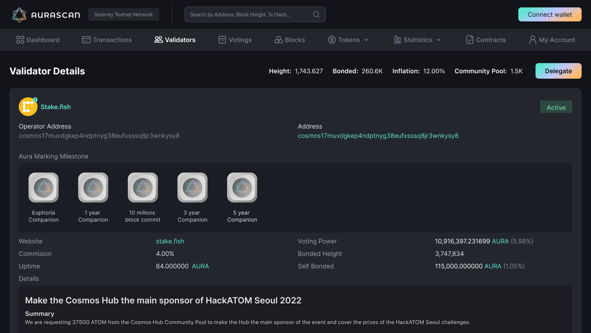

# Validator Call: Preparation for Xstaxy Mainnet

*Date: Nov 14, 2022*

*This document outlines several important steps for Aura Network validators to prepare for our mainnet (code name: Xstaxy) launch. Whether you are a validator, a node runner, a developer or a token holder, these are things you should be aware of to keep up with the development of Aura Network.*

*TL;DR:*
- *Euphoria Incentivized Testnet Program complete*
- *Canary network EUPHORIA-2 launch*
- *Introduction of Aura Foundation Delegation Program*
- *Mainnet preparation checklist*
- *Feedback [here](https://github.com/orgs/aura-nw/discussions)*

## Table of Contents
- [Validator Call: Preparation for Xstaxy Mainnet](#validator-call--preparation-for-xstaxy-mainnet)
  * [1. Context](#1-context)
  * [2. Euphoria Validator Program result](#2-euphoria-validator-program-result)
    + [Master of Node result](#master-of-node-result)
    + [IVP rewards](#ivp-rewards)
  * [3. Euphoria-2 canary network introduction](#3-euphoria-2-canary-network-introduction)
  * [4. Distributing IVP Rewards](#4-distributing-ivp-rewards)
  * [5. Foundation Delegation Program](#5-foundation-delegation-program)
  * [6. Mainnet Checklist](#6-mainnet-checklist)

<small><i><a href='http://ecotrust-canada.github.io/markdown-toc/'>Table of contents generated with markdown-toc</a></i></small>

## 1. Context

Aura Network has been continuously building since Q4 2021, there have been 3 successful testnet launches: Halo, Serenity and Euphoria. At the same time, the BEP-20 $Aura token was released on BNB Chain and got positive feedback from the community. It is time for Aura Network to move to the next major milestone: **mainnet** launch, code name: ***Xstaxy***. 

As BEP-20 Aura token is already distributed, the mainnet launch is not simply just running a new software binary with different configurations. There are several requirements to ensure a secure and successful launch as follows:
- Xstaxy token distribution must fully reflect Aura tokenomics and current token circulating supply.
- Xstaxy validator set is distributed, reputable, reliable and fully committed to contribute to the success of Aura Network.
- Participants of Euphoria IVP are fully compensated as pre-agreement.
- A detailed checklist of mainnet launch.

This document provides a detailed plan for the Aura Network community to follow to prepare for Xstaxy. However, in case you have any suggestion on the plan, please feel free to submit your idea on our Github discussion [forum](https://github.com/orgs/aura-nw/discussions).

## 2. Euphoria Validator Program result

Going live from July 13th 2022, the Euphoria network is a staging environment for application development on Aura Network. We also introduced our incentive program for Euphoria validators and got amazing support from more than 50 reputable validators. 

### Master of Node result

Aura Network hosted the [***“Master of Nodes”***](https://insight.aura.network/the-game-of-harmony-validator-campaign/) game to encourage validators to engage and demonstrate their skills. You can find the result to the game [**here**](https://docs.google.com/spreadsheets/d/1u0GcZjzvZGWOWfFLlAhr3s4UI7_9V1X3aYlCy3kk0GU/edit)

The top 30 validators from the game are divided into 4 ranking tiers based on their total points. From the top: Grand Master, Master, Arcanist, Seer. Each validator will receive one Account-bound Token (non-transferable NFT), or in short ***ABT***, depending on their ranking tier. Aura Account-bound Token is implemented in CosmWasm, following CW-4973 standard (inspired by [EIP-4973](https://eips.ethereum.org/EIPS/eip-4973)). Validators owning this token will be able to “equip” it to show on their validator profile on Aurascan. Sample below.

The Account Bound Token feature is to award validators who have special contributions to Aura Network as well as participating in various campaigns. Other special events and achievements will also be issued under this form.

### IVP rewards

Validators in the Euphoria IVP are rewarded 60 $AURA per day, except days that they are offline. Starting from ***July 13th 2022***, as there is a limit on the program budget we decide that the program should be ended by ***November 15th 2022***. So it is exactly **125 days** for running Aura nodes for validators. Thus, the maximum reward for a validator is ***7500 $AURA***.

There are 2 ways that a validator can get these rewards:
- **Get all rewards:** a validator can submit their non-custody BEP-20 address to receive rewards of the already listed Aura token. However, to prevent token dumping that may negatively, we will put rewards tokens in the Coin98 Vault and automatic linear vesting over 2 weeks. Please find information on how to use Coin98 Vault here: https://coin98.net/what-is-coin98-vault
- **Get 50% rewards (or less):** a validator can, instead, choose to receive up to 50% of their rewards with a similar vesting schedule like the previous method. The rest of the token amount will be distributed directly to the genesis block of Xstaxy mainnet for that validator. This is because in the beginning of launching Xstaxy, there is no other source of token to stake rather than just wait for centralized exchanges to enable token withdrawal.

Please be noted that it is up to the validator to choose how they want to receive IVP rewards, there is no problem if a validator chooses to withdraw all rewards and sell it on the open market to cover the cost of running testnet nodes during the IVP.

Beside BEP-20 $AURA, each validator staying the IVP until the end will receive an ABT to show that they have completed the program. This is a different ABT than the previous master of node one.

*Validators can find the link to the registration form to receive rewards in the email they used to register for the Euphoria IVP.*

## 3. Euphoria-2 canary network introduction

As our [previous discussion](https://github.com/orgs/aura-nw/discussions/1), Aura is moving towards a *permissioned smart contract platform* where every contract deployed on Xstaxy is open source. Thus, even after the IVP, we still want to keep Euphoria running with a certain number of validators so that we can continue testing new features and verify smart contracts before allowing them to be deployed on mainnet.

For this reason, we introduce **Euphoria-2**, the official staging/canary network for Aura Network. This network is a fork upgrade of the current Euphoria network with several requirements:
- Euphoria-2 is **NOT** an incentivized testnet.
- Only validators who receive foundation delegation must run a Euphoria-2 node. Please refer to the foundation delegation program for more details.
- It is totally up to any validator to run Euphoria-2 nodes, there is no benefit in it if you are not receiving foundation delegation. However, if any validator wants to volunteer to support the project, please let us know in the registration form sent via email so that we can adjust the maximum validator slot number.

**NOTE**: Information related to launch Euphoria-2 will be announced in Discord Euphoria Validator channel.

## 4. Distributing IVP Rewards

There are some steps for validators to receive Aura tokens from IVP and continuing with Euphoria-2:
- Fill in the form attached to an email you receive from us (for safety, we will only accept forms from these emails)
- Vote for a proposal to reduce the validator set after we know how many validators want to stay.
- Unbond EAURA tokens to remove your validator if you do not run Euphoria-2 and please send back those test tokens to the Euphoria Token Faucet at: [aura1n5zqsfy47wmk8j476cf2244rfvrgvkwf6qeaeh](https://euphoria.aurascan.io/account/aura1n5zqsfy47wmk8j476cf2244rfvrgvkwf6qeaeh)

## 5. Foundation Delegation Program

We also introduce the draft of the Aura Foundation Delegation Program for validator feedback [***HERE***](https://github.com/aura-nw/mainnet-artifacts/blob/main/Foundation-delegation-program/README.md).

Please be noted that this is a DRAFT version of the program, it is recommended for every validator to read and feedback.

## 6. Mainnet Checklist

Mainnet Date: TBA

| #           | To-do | Aura   | Partners |
|----------------|---------------|---------------|----------------|
|1  |  Generate pre-launch genesis with custom parameters| &#9745; |    |
|2  |  Upload pre-launch genesis and instructions to Xstaxy repo| &#9745; |    |
|3  |  Generate validator transaction | |  &#9745;  |
|4  |  Submit gentx and logo (optional) by forking Xstaxy repo  and create a Pull Request|  | &#9745;   |
|5  |  Collect gentx, verify and finalize genesis| &#9745; |    |
|6  |  Upload finalized genesis to Xstaxy repo| &#9745; |    |
|7  |  Replace pre-launch genesis by the finalized one| &#9745; | &#9745;   |
|8  |  Setup validators (aurad, cosmovisor services) Optional: seed nodes, full nodes, sentry nodes| &#9745; |  &#9745;  |
|9  |  Setup AuraScan | &#9745; |    |
|10  |  Run node and wait for Xstaxy launching time| &#9745; |    |
|10  |  Generate pre-launch genesis with custom parameters| &#9745; | &#9745;   |
